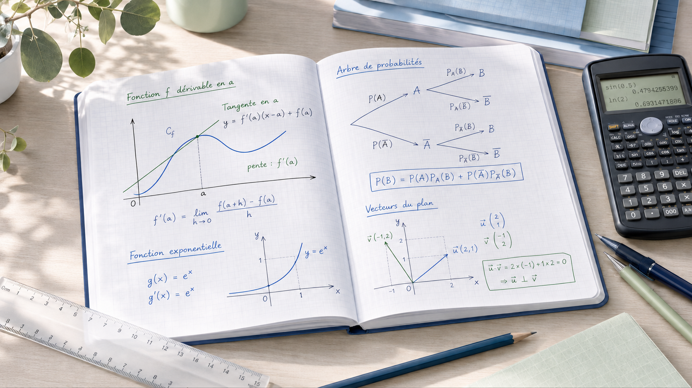

---
hide:
  - navigation
  - toc
---

<section class="maths-brand">
  

    
Mathématiques

    <h1>Première spécialité</h1>
    
Un espace de travail pour construire les méthodes, consolider les automatismes et préparer progressivement les exigences du cycle terminal.

  

</section>

<section class="maths-hero">
  

    <h2>Comprendre, s'entraîner, progresser.</h2>
    
Bienvenue sur le site de mathématiques du lycée Franklin. Vous y retrouverez les cours, les TD, les automatismes, les corrigés publiés et les ressources utiles pour travailler avec régularité.

    

      <a class="maths-button" href="#acces-rapide">🚀 Commencer à travailler</a>
      <a class="maths-link-button" href="progression/">Voir la progression →</a>
    

  

  

    
  

</section>

<section class="maths-cards">
  <a class="maths-card maths-card--blue" href="#acces-rapide">
    

      📘
      <h3>Cours</h3>
    

    
Retrouver les définitions, propriétés et exemples essentiels de chaque notion.

    →
  </a>
  <a class="maths-card maths-card--green" href="td/">
    

      📝
      <h3>TD</h3>
    

    
S'entraîner avec les exercices donnés en classe ou à la maison.

    →
  </a>
  <a class="maths-card maths-card--yellow" href="automatismes/">
    

      ⚡
      <h3>Automatismes</h3>
    

    
Travailler régulièrement les techniques rapides à maîtriser.

    →
  </a>
  <a class="maths-card maths-card--purple" href="progression/">
    

      🎯
      <h3>Progression</h3>
    

    
Suivre les notions de l'année et les échéances importantes.

    →
  </a>
</section>

<section class="maths-footer-row">
  

    📅
    

      <strong>À ne pas manquer.</strong> 
      Les ressources sont mises à jour progressivement. En cas d'absence, commencez par consulter la notion travaillée, puis récupérez le cours et le TD associés.
    

  

  

    <blockquote>
      « Les mathématiques ne sont pas une question de talent, mais de méthode et de persévérance. »
      <cite>— Claire Voisin</cite>
    </blockquote>
    💡
  

</section>

Lycée Franklin — Académie de Rennes · Mathématiques Première spécialité · Année scolaire 2026-2027

## Accès rapide

<!--
Les liens vers les notions de l'année sont ajoutés ou complétés par les scripts de publication.
Ne pas supprimer le titre "## Accès rapide" : il sert de point d'ancrage aux scripts.
-->

- [Progression visuelle](progression.md)
- [N01 — Logique ensembles](notions/N01-logique-ensembles.md)
- [N02 — Calcul algebrique équations](notions/N02-calcul-algebrique-equations.md)
- [N03 — Fonctions lectures variations](notions/N03-fonctions-lectures-variations.md)
- [N04 — Repérages vecteurs](notions/N04-reperages-vecteurs.md)
- [N05 — Second degré I](notions/N05-second-degre-i.md)
- [N06 — Second degré II](notions/N06-second-degre-ii.md)
- [N07 — Taux de variation](notions/N07-taux-de-variation.md)
- [N08 — Nombre dérivé derivation](notions/N08-nombre-derive-derivation.md)
- [N09 — Dérivées usuelles](notions/N09-derivees-usuelles.md)
- [N10 — Variations extremums](notions/N10-variations-extremums.md)
- [N11 — Suites definition](notions/N11-suites-definition.md)
- [N12 — Suites arithmétiques et géométriques](notions/N12-suites-arithmetiques-geometriiques.md)
- [N13 — Sommes modeles discrets](notions/N13-sommes-modeles-discrets.md)
- [N14 — Algorithmique](notions/N14-algorithmique.md)
- [N15 — Droites équations](notions/N15-droites-equations.md)
- [N16 — Trigonométrie](notions/N16-trigonometrie.md)
- [N17 — Produit scalaire I](notions/N17-produit-scalaire-i.md)
- [N18 — Produit scalaire II](notions/N18-produit-scalaire-ii.md)
- [N19 — Géométrie repérée](notions/N19-geometrie-reperee.md)
- [N20 — Fonctions exponentielles](notions/N20-fonction-exponentielle.md)
- [N21 — Exponentielle II](notions/N21-exponentielle-ii.md)
- [N22 — Probabilités conditionnelles](notions/N22-probabilites-conditionnelles.md)
- [N23 — Indépendance arbres](notions/N23-independance-arbres.md)
- [N24 — Variables aléatoires espérance](notions/N24-variables-aleatoires-esperance.md)
- [N25 — Syntheses Automatismes](notions/N25-syntheses-automatismes.md)
